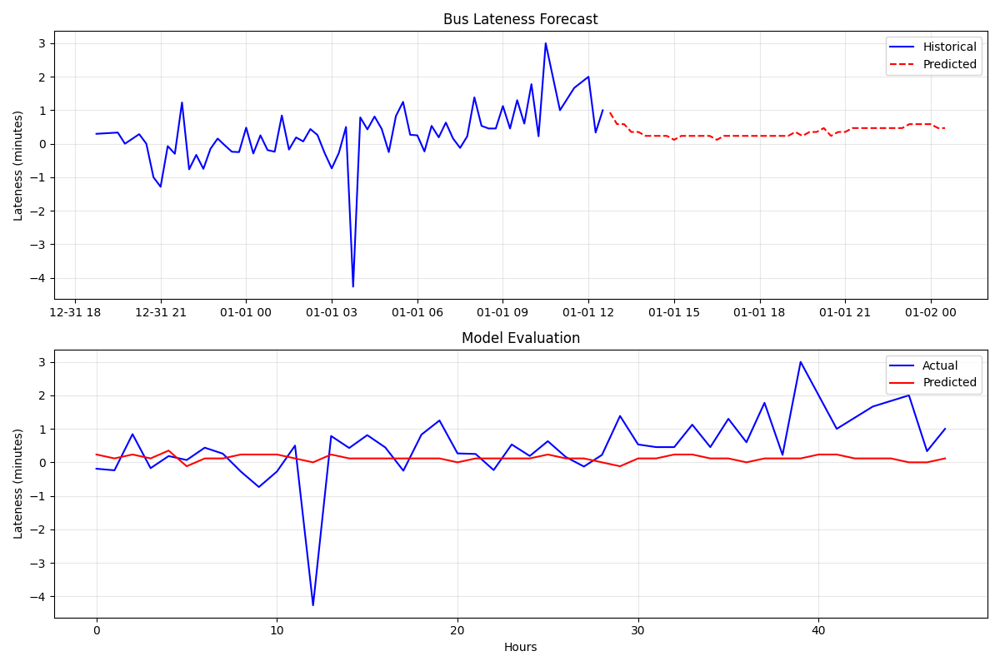

# Bus Lateness Prediction Analysis
    [](https://opensource.org/licenses/MIT)
<br>
<p align="center">
  
</p>
<br>

<p align="center">
  <a href="#summary"> Executive summary </a> •
  <a href="#data"> Sourcing data </a> •
  <a href="#munge_eda"> Data Transformation </a> •
  <a href="#mine"> Data Mining and EDA</a> •
  <a href="#models"> Modelling </a> •
  <a href="#plots"> Plotting results </a> •
  <a href="#conc"> Conclusions</a>
</p>

<a id = 'summary'></a>

## Executive Summary

From data analysis, bus routes in urban areas are more likely to be late or extremely late (>30 minutes) than buses in other suburbs, and latness often spikes on Wednesdays and Fridays. The chosen regression models while were not adequate in capturing the variation of lateness, both consistently suggested spatial features, like `route` and `transit_stop_sequence`, provide strong predictive insights into lateness. 

ChronosT5 was fine-tuned and forecasted lateness to be around 0.1-0.9 minute for the following 12-hours. The model's performance deteriorate for datasets with >100k observations, potentially due to model size, which limits the ability to extrapolate on the full dataset.  

Additionally, since data was recorded in 3 distinct, non-sequential periods, structuring this problem as a time series may not be sufficient for ChronosT5

<a id = 'data'></a>

## Sourcing data

The 2016 Bus Occupancy Dataset, available via OpenData NSW, was used for this project. The dataset includes:

- **Route information**: Bus route identifiers, stop sequences, and route characteristics

- **Temporal data**: Scheduled departure times, and actual departure times

- **Operational data**: Bus occupancy levels, vehicle capacity, transit sequence

- **Geographic data**: Stop locations, route distances, lattitude and longitude

<a id = 'munge_eda'></a>

## Data Transformation and EDA

Data transformation procedures performed:

- Checking the time span of the data and ensuring consistent temporal coverage across all routes

- Casting the temporal features, `calendar_date`, `timetable_time` and `actual_time` to DateType and Timestamp data types respectively

- Calculating lateness as the difference between actual and scheduled departure times

- Eliminating whitespaces and standardising all string-value variables to lowercase

- Dropping `null` values in the `actual_time` column, since the absence of these values are random

- Creating time-based features such as hour of day, day of week, and peak/off-peak indicators

- Examining the data we find that the maximum lateness values were many standard deviations larger than the mean, indicating the presence of outliers. Keeping extreme outliers in the analysis would skew the predicted lateness patterns.

- Create stratified samples of sizes 10K to 100K of the full dataset, since there are >20M trips made in total

<a id = 'mine'></a>

## Mining the data

Some of the steps for mining the data included: computing average lateness per route and computing both passenger load factors and frequency-based metrics.

Outliers are diverse within the datasets acquired, however, as I was not able to verify whether each outlier occured at random (outages, traffic incident, etc.), I was not able to justify removing these data points. They are standardised in the model preprocessing step.

I then looked for any statistical relationships, correlations, or other relevant properties of the dataset that could influence bus lateness.

**Steps**:

- First I needed to choose the proper predictors. I looked for strong correlations between variables to avoid problems with multicollinearity

- Also, variables that changed very little had minimal impact and were therefore not included as predictors

- I then studied correlations between predictors and the target variable (lateness)

- I saw from the correlation matrices that `occupancy_level` and `load_factor` are highly correlated. Furthermore, both are correlated to the target variable `lateness_minutes`. Similar patterns emerged with `capacity`

A heatmap of correlations using `Seaborn` follows:

<p align="center">
   
<p/>

<a id = 'models'></a>

## Building the models

Using `scikit-learn`, I instantiate a `LinearRegression` model and a `TweedieRegressor` with `power=0` and evaluated their fit.

The models were 3-folds cross validated using `GridSearchCV`, and the best models with their coefficients were obtained via:

```python
best_linear_model = linear_grid_search.best_estimator_
best_linear_model.named_steps[f"{best_linear_model}"].coef_
```

<a id = 'plots'></a>

## Plotting results

The usual diagnostic plots were then created after the fit:

<p align="center">
   
<p/>

<p align="center">
   
<p/>

ChronosT5's predictions are plotted beloe

<p align="center">
   
<p/>

<a id = 'conc'></a>

Both models generated negative $R^2$ scores, indicating these regression models are not be sufficient models in capturing the variation of lateness within these datasets. The linear model illustrates an interesting behaviour of the residuals, where residuals follow a negative linear trend while the Gaussian GLM shows resdiuals tend to cluster. Error metrics are quite high, suggesting the results these models generate are not precise enough to be useful.

## Conclusions and recommendations

The following conclusions were derived from the lateness regression analysis:

- **Occupancy correlation**: Higher occupancy levels correlate with increased lateness due to longer boarding times. Routes with consistently high occupancy should consider increased frequency or larger vehicles

- **Route-specific patterns**: Certain route (607x) consistently underperform in punctuality. These routes require targeted interventions such as dedicated bus lanes or schedule adjustments

- **Day-of-week variations**: Weekend services show different lateness patterns compared to weekdays, suggesting the need for differentiated scheduling approaches

- **Further improvement**:

  - Use bootstrap or similar data generation methods to acquire synthetic data for the period September-early November where data was not collected

  - Integrate environmental covariates (weather, traffic conditions, etc.) into modelling

  - Focus on reducing dwell times at high-occupancy stops through improved boarding processes
