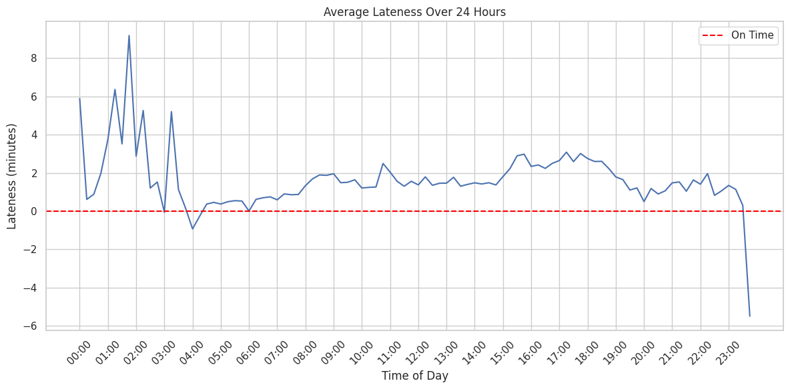
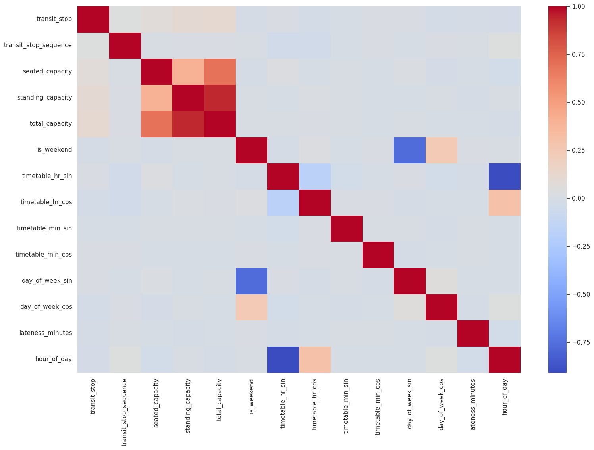
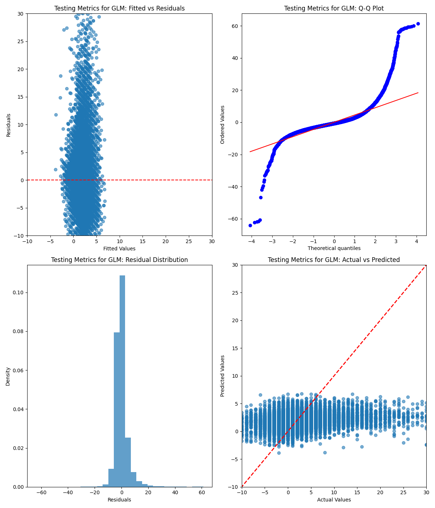
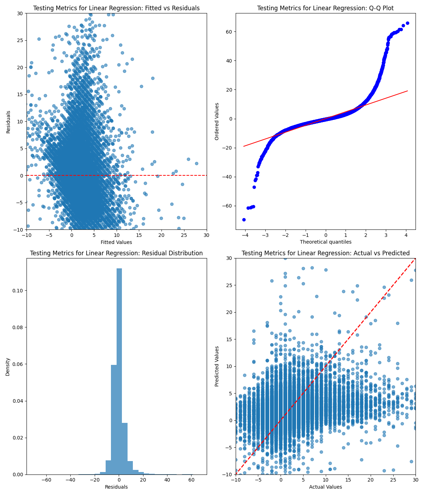

# Bus Lateness Prediction Analysis


[](https://opensource.org/licenses/MIT)
<br>
<p align="center">
  
</p>
<br>

<p align="center">
  <a href="#summary"> Summary </a> •
  <a href="#data"> Sourcing Data </a> •
  <a href="#munge_eda"> Data Transformation </a> •
  <a href="#mine"> Data Mining and EDA</a> •
  <a href="#models"> Models </a> •
  <a href="#plots"> Results </a> •
  <a href="#fine_tune"> Fine Tunning </a> •
  <a href="#conc"> Conclusions</a>
</p>

<a id = 'summary'></a>

## Summary

This investigates lateness patterns in New South Wales (NSW)' 2016 bus network. Using real-world NSW transport data, it analyses over 20 million bus trips to identify how time-of-day, route, service types and route sequence affect arrival punctuality.

Key findings include:

- Buses are most likely late by **2–6 minutes**, especially on urban routes.
  
- **Afternoon peak (3–6 PM)** is associated with higher delays, which decreases later in the day.
  
- Variation is higher on certain routes, suggesting targets for schedule adjustment.
  
- Urban areas' services are more likely to be late or extremely late (>30 minutes).

- Services experience seasonal lateness spike on Wednesdays and Fridays.

The project applies regression modeling with cross-validation and focuses on **explaining lateness** rather than forecasting specific values, although a forecasting model (ChronosT5) was fine-tuned to explore this aspect.

It should also be noted that the data was recorded in 3 discontinuous periods, structuring this problem as a continuous time series may not have been sufficient for the forecasting model. Also, data was not available to verify the predictions made.

Relevant notebooks and scripts are found under `src/`.

<a id = 'data'></a>

## Sourcing Data

The 2016 Bus Occupancy Dataset, available via OpenData NSW, was sourced for this project. The dataset includes:

- **Route information**: Bus route identifiers, stop sequences, and route characteristics

- **Temporal data**: Scheduled and actual departure times

- **Operational data**: Bus occupancy levels, vehicle capacity, transit sequence

- **Geographic data**: Services' suburb, route distances, lattitude and longitude

<a id = 'munge_eda'></a>

## Data Transformation and EDA

Data transformation procedures performed:

- Checking the time span of the data and ensuring consistent temporal coverage across all routes

- Casting the temporal features, `calendar_date`, `timetable_time` and `actual_time` to DateType and Timestamp data types respectively

- Examining the data we find that the maximum lateness values were many standard deviations larger than the mean (~1400 minutes). These values are not informative to lateness, and keeping extreme outliers in the analysis would skew the predicted lateness patterns. Therefore capping was performed to limit outlier values to the range $[-60, 60]$ minutes

- Calculating lateness as the difference between actual and scheduled departure times

- Eliminating whitespaces and standardising all string-value variables to lowercase

- Dropping `null` values in the `actual_time` column, since the absence of these values are random

- Creating time-based features such as hour of day, day of week, and peak/off-peak indicators

- Create stratified samples of sizes 10K to 100K of the full dataset, since there are >20M trips made in total

Aggregating data into 15-minute bins, there seems to be a spike in lateness earlier in drivers' shift and a gradual decrease as the day is ending. From this, I inferred customers usage/occupancy of buses may be a strong predictor of lateness.

<p align="center">
   
<p/>

<a id = 'mine'></a>

## Mining the data

Some of the steps for mining the data included: computing average lateness per route and computing both passenger load factors and frequency-based metrics.

Outliers are diverse, with lateness ranges from $-1400$ minutes to $1500$ minutes. For lateness, these values were likely caused by structural issues rather than randomly occurred, so I capped these `lateness_minutes` values to $\pm 60$ minutes to ensure the distribution of the target population align with the problem.

I then looked for any statistical relationships, correlations, or other relevant properties of the dataset that could influence bus lateness.

**Steps**:

- First I needed to choose the proper predictors. I looked for strong correlations between variables to avoid problems with multicollinearity

- I then studied correlations between predictors and the target variable (lateness)

- Most variables have weak correlation with the target `lateness_minutes`

A heatmap of correlations using `Seaborn` follows:

<p align="center">
   
<p/>

<a id = 'models'></a>

## Building the models

Using `scikit-learn`, I instantiate a `LinearRegression` model and a `TweedieRegressor` with `power=0` and evaluated their fit.

The models were 5-folds cross validated using `GridSearchCV`, and the best models with their coefficients were obtained via:

```python
best_linear_model = linear_grid_search.best_estimator_
best_linear_model.named_steps[f"{best_linear_model}"].coef_
```

<a id = 'plots'></a>

## Plotting results

The usual diagnostic plots were then created after the fit:

<p align="center">
   
<p/>

<p align="center">
   
<p/>

The regression results of the models are included.

For the **Gaussian GLM with the `auto` link**:

```text
=== Regression Results ===
R² (Train): 0.0829
R² (Test): 0.0542
RMSE (Train): 5.0642
RMSE (Test): 5.1763

=== Feature Coefficients ===
                                    Feature  Coefficient  Abs_Coefficient
               onehot__route_variant_370-18     2.836216         2.836216
               onehot__route_variant_418-23     2.738374         2.738374
              onehot__route_variant_422-103     2.427793         2.427793
               onehot__route_variant_418-12     2.426269         2.426269
               onehot__route_variant_t71-68     2.391006         2.391006
```

For the vanilla **Linear Regression**:

```text
=== Regression Results ===
R² (Train): 0.2287
R² (Test): 0.0118
RMSE (Train): 4.6440
RMSE (Test): 5.2910

=== Feature Coefficients ===
                                    Feature  Coefficient  Abs_Coefficient
               onehot__route_variant_207-48    56.508799        56.508799
                 onehot__route_variant_57-6    48.794709        48.794709
             onehot__route_variant_620x-206    41.680966        41.680966
               onehot__route_variant_692w-2    36.972149        36.972149
              onehot__route_variant_754-206    33.870166        33.870166
```

Both models had fairly low $R^2$ scores, with better $R^2$ given to the Gaussian GLM, meaning $5.4\%$ of total variation was captured in the test set. Regression errors are fairly low for both model, so both adequately performed in the test set. The states of the three datasets not being sequential or connected might also have contributed to this low performance.

Also, both models attributed variants of the `route_variant` feature to be a feature with high predictive power, aligns with the belief that some travelling sequences might be more susceptible to be late than other. For futher investigation, further sequence group and adding an interaction term with `time_of_day`, to study which sequence is late at which time, might uncover more insights.

<a id = 'fine_tune'></a>

## Fine Tuning

A ChronosT5-tiny was fine-tuned to better study the patterns in lateness. Preprocessing module used is included under the [`src` directory](./src/chronos_t5/parquet_preprocessing.py), additional notes are included in the README.

The performance of zero-shot and in-domain inferences is displayed below:

### Zero-shot inference

| dataset              | model | MASE | WQL |
| :---------------- | :------: | ----: |----: |
| bus_lateness_dataset | amazon/chronos-t5-tiny | 3.2575229047563976 | 0.1947324275149751 |

---

### In-domain inference

| dataset              | model | MASE | WQL |
| :---------------- | :------: | ----: |----: |
| bus_lateness_dataset | ./finetuned_chronos/run-0/checkpoint-final | 2.7867063388247733 | 0.17843434113949755 |

Fine-tune reduced the mean absolute error and improved the prediction's accuracy. However, without access to actual data, it's difficult to verify the precision of these values.

### Forecasted lateness

Some forecasted values for the first 3 series at the $12^{th}$ time step are displayed:

| item_id | q10 | q50 | q90 |
| :---------------- | ----: |----: |----: |
| 1-2_austinmer | 3.9960 | 3.9999 | 4.0482 |
| 1-5_corrimal | 1.9817633628845215 | 1.9817633628845215 | 2.005544662475586 |
| 11-5_wollongong | $\approx$ 0 | $\approx$ 0 | 0.0402 |

This aligns with insights from data analysis, which showed latenes generally lie within the 2-6 minutes range.

<a id = 'conc'></a>

## Conclusions

The following conclusions were derived from the lateness regression analysis:

- **Occupancy correlation**: Higher occupancy levels correlate with increased lateness due to longer boarding times. Routes with consistently high occupancy should consider increased frequency or larger vehicles

- **Route-specific patterns**: Certain route consistently underperform in punctuality. These routes require targeted interventions such as dedicated bus lanes or schedule adjustments

- **Day-of-week variations**: Weekend services show different lateness patterns compared to weekdays, suggesting the need for differentiated scheduling approaches

- **Further improvement**:

  - Use bootstrap or similar data generation methods to acquire synthetic data for the period September-early November where data was not collected

  - Integrate environmental and spatial covariates (weather, traffic conditions, etc.) into modelling

  - Better definition of problem, taking into account data availability and relevancy

So, if we assume the post-Covid bus usage in 2025 is similar to pre-Covid rates in 2016-2017, commuters will likely see their services being late if they live in urban areas, with predicted average latetime ranging from 3-6 minutes.
